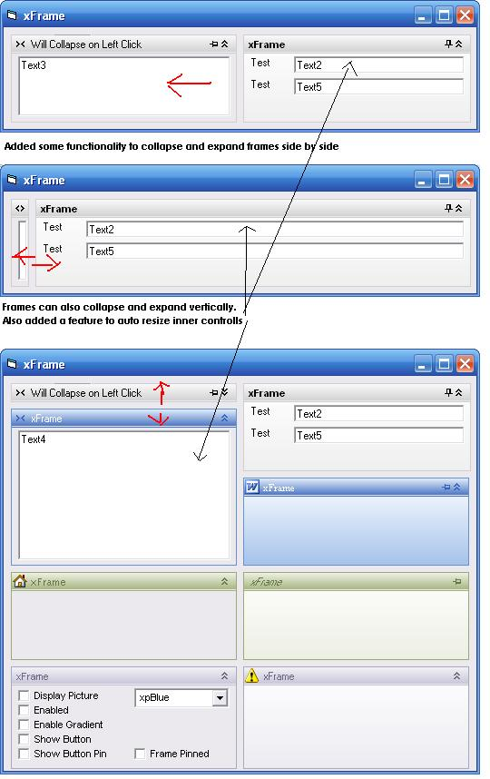



## xFrame Usercontrol v2

### Description

This an update to the award winning code of Goober MPC wich you can find on http://www.planet-source-code.com/vb/scripts/ShowCode.asp?txtCodeId=68342&lngWId=1. I amnot trying to take credit for his creation. Just added some extra functionality that is very usefull for me.

I got tired of trying to figure out ways how to fit controlls in my forms in such a way you can expand of collapse the controll, so you could have more space for what you are doing at the moment and you can push other controlls witch are taking a lot of screenspace aside.

I also figured that with resizing and collapsing controlls on the fly it would handy if you don't need to write code to resize inner controlls any time, so I made a small function for it.

I have been getting a lot of great code and ideas from this website for years so I tought it would be fair to add something myself.

----

UPDATE TO PREVIOUS VERSION IS OUT 11-06-2010

----

Fixed a view bugs and added some interesting new functionality

- The frames can collapse jointly from left to right, from right to left, from top to down or from down to up, depending on how you set it

- The borderstyle in the frames can be set to FLAT or SUNKEN or whatever FOR ALL CONTROLLS contained in the frame with one line of code.

JUST DRAG IT ON yOUR FORM, EDIT SOME SETTINGS AND YOU ARE READY TO ROLL, so you can concentrate on what your app should do and not on those silly lines regarding resizing and organizing controlls on your form.

The only interesting feature I would like to add is the ability to load forms in the frame, because then you could easily make dockable apps that don't act unpredictable and come with shiploads of code.
 
### More Info
 

             |
---                |---
**Submitted On**   |2010-06-11 15:54:40
**By**             |[Orson73](https://github.com/Planet-Source-Code/PSCIndex/blob/master/ByAuthor/orson73.md)
**Level**          |Advanced
**User Rating**    |4.8 (38 globes from 8 users)
**Compatibility**  |VB 6\.0
**Category**       |[Custom Controls/ Forms/  Menus](https://github.com/Planet-Source-Code/PSCIndex/blob/master/ByCategory/custom-controls-forms-menus__1-4.md)
**World**          |[Visual Basic](https://github.com/Planet-Source-Code/PSCIndex/blob/master/ByWorld/visual-basic.md)
**Archive File**   |[xFrame\_Use2182776112010\.zip](https://github.com/Planet-Source-Code/orson73-xframe-usercontrol-v2__1-73196/archive/master.zip)

